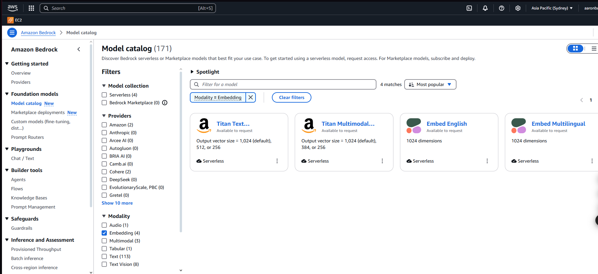
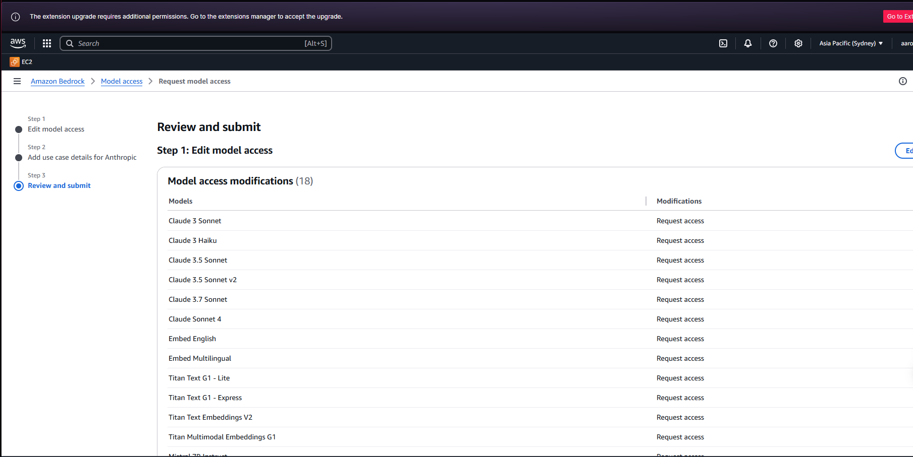
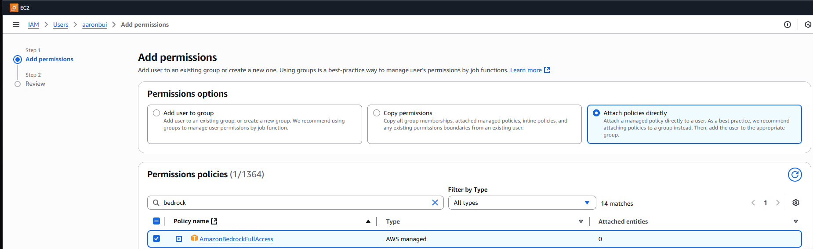
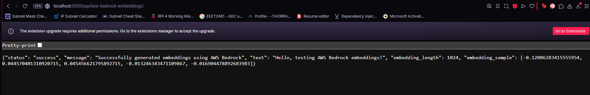

# Research Embedding Models in Amazon Bedrock

These AI Models are available 6/22/2025 in ap-southeast-2 region.
Go to link:

https://ap-southeast-2.console.aws.amazon.com/bedrock/home?region=ap-southeast-2#/model-catalog?region=ap-southeast-2&modality=Embedding

Remember to request access for the model you want to use.

https://ap-southeast-2.console.aws.amazon.com/bedrock/home?region=ap-southeast-2#/modelaccess

For this app, i will use Titan Text Embeddings V2.

Edit IAM Role to FullAccess AmazonBedrockFullAccess.

I Highly reccomend read User Guide Amazon Bedrock, the example code is in there:
https://docs.aws.amazon.com/pdfs/bedrock/latest/userguide/bedrock-ug.pdf#service_code_examples_bedrock-runtime_amazon_titan_text_embeddings