# Create IAM Role for kendra

IAM > Roles

Click on Create role

Add Custom Trust Policy

{
  "Version": "2012-10-17",
  "Statement": [
    {
      "Effect": "Allow",
      "Principal": {
        "Service": "kendra.amazonaws.com"
      },
      "Action": "sts:AssumeRole"
    }
  ]
}

Then Add Permissions policies:

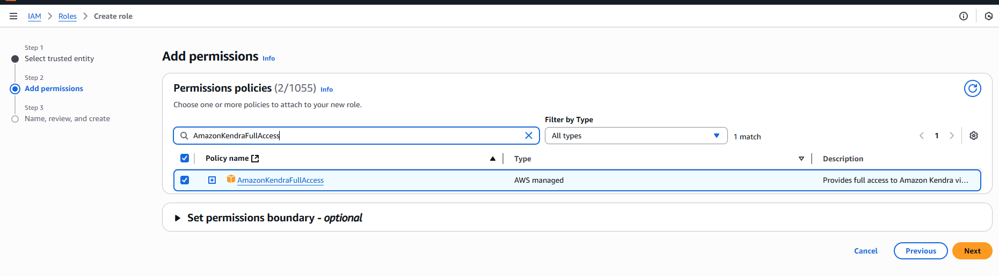

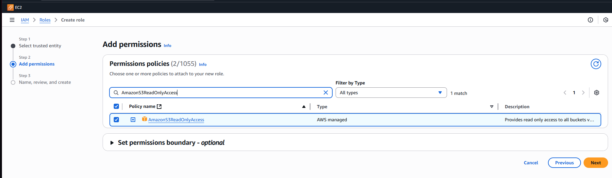

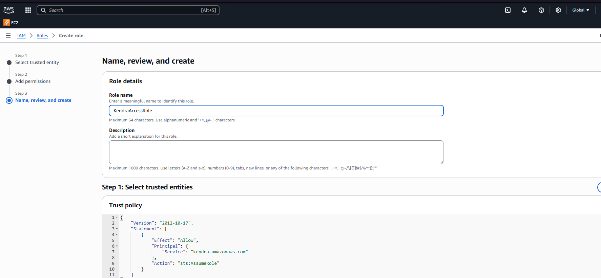

Then add inline policy

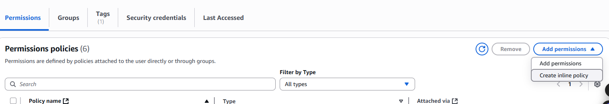

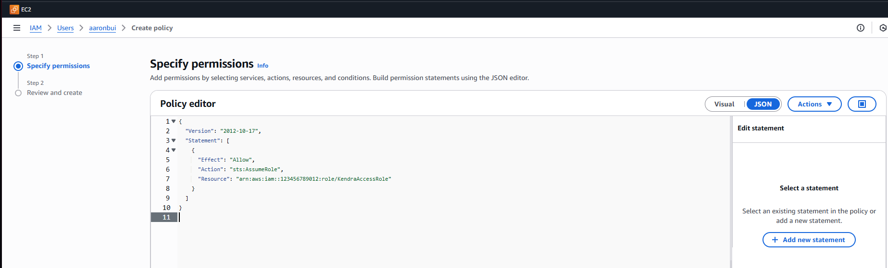

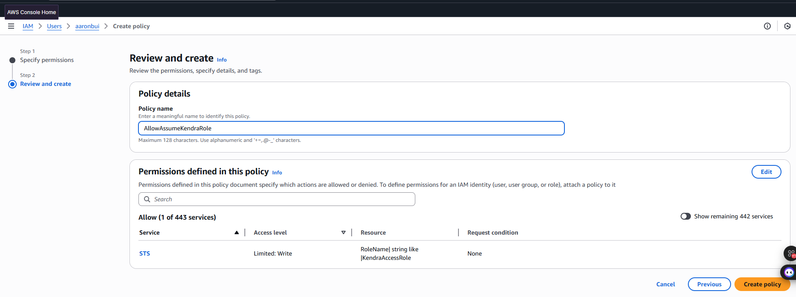

# Amazon Kendra

https://ap-southeast-2.console.aws.amazon.com/kendra/home?region=ap-southeast-2#welcome

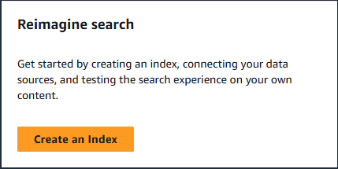

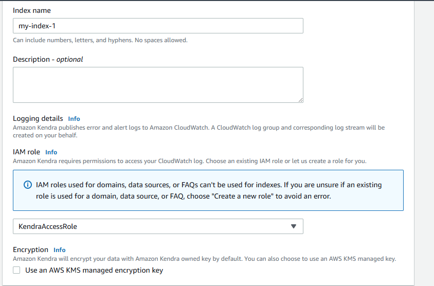

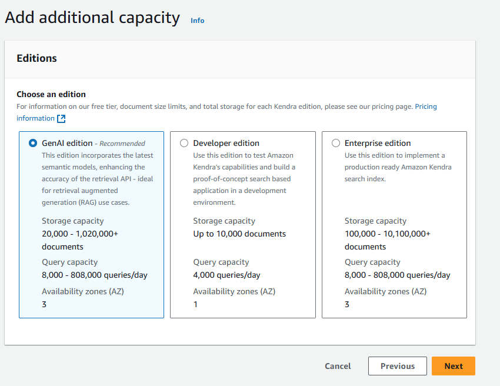

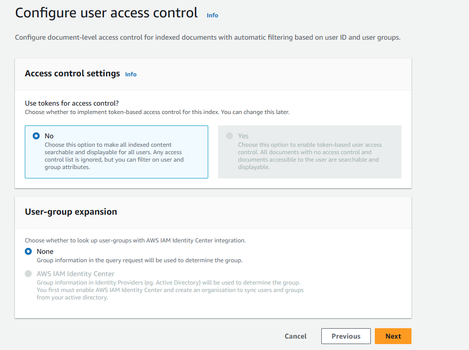

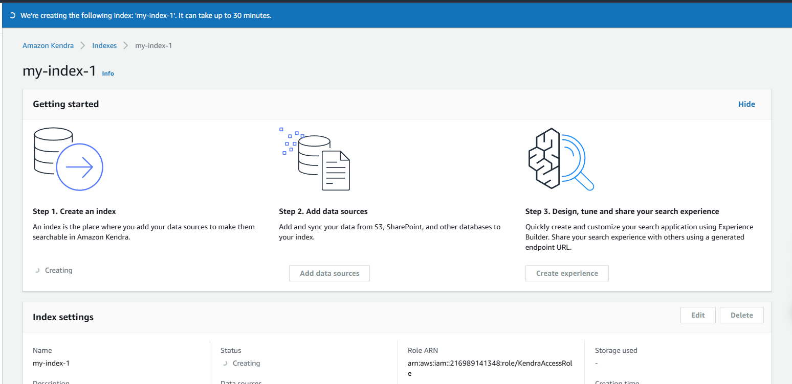