# Create AWS RDS

Important Note: No need to turn on public access to Yes since we will connect using SSH and AWS EC2. Moreover, there are risk turn this on because of security reason.

Go to link: https://ap-southeast-2.console.aws.amazon.com/rds/home?region=ap-southeast-2#

Click on Databases -> Create database

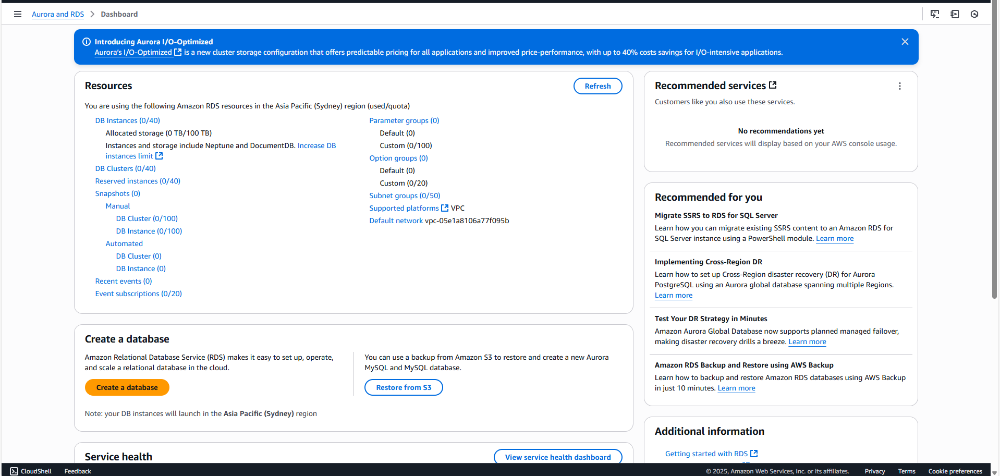

For this demo, i will be using PostgreSQL database engine with engine version PostgreSQL 17.4-R1 and Templates Free Tier.

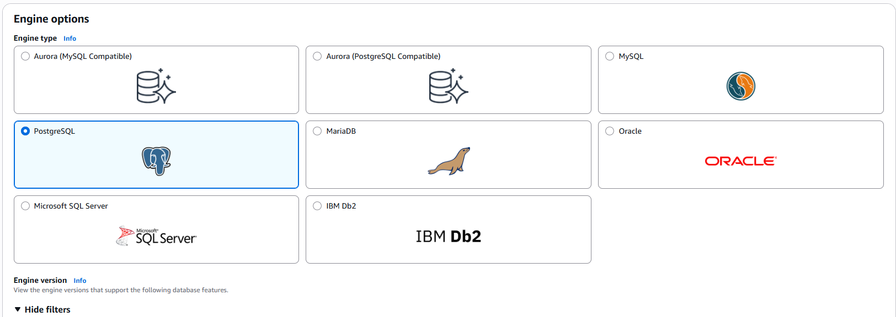

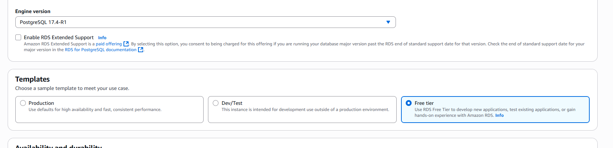

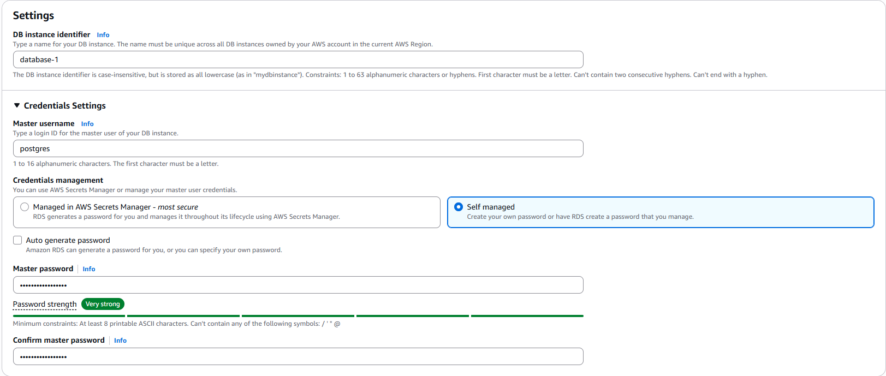

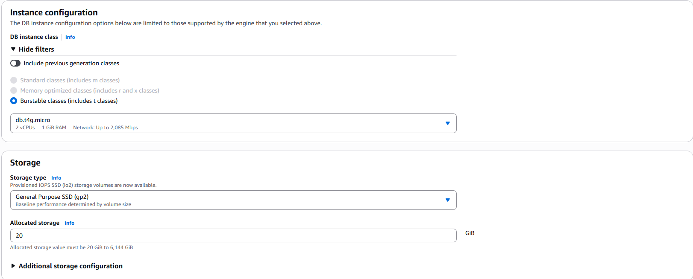

For Connectivity, connect with AWS EC2 that you created early on and running
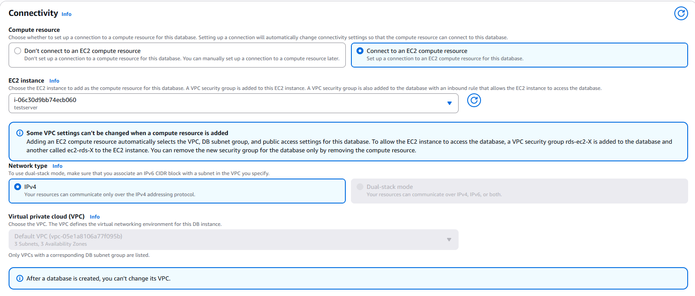

For VPC security group, select the one you created earlier

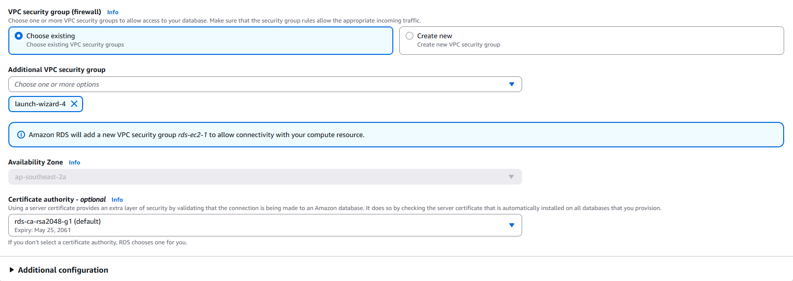

For database authentication, i will use Password authentication. Feel free to use others.

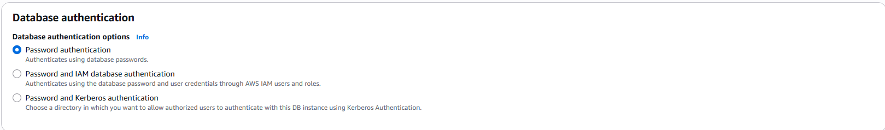

For Monitoring, i will use 7 Days since it's free tier.

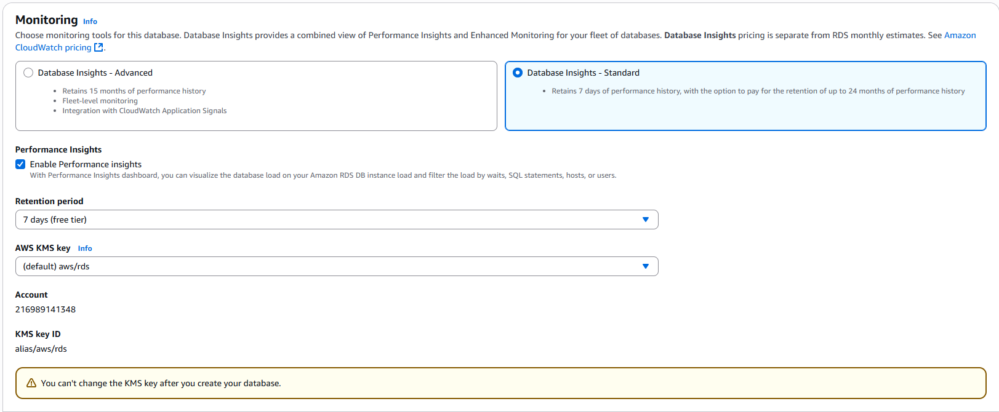

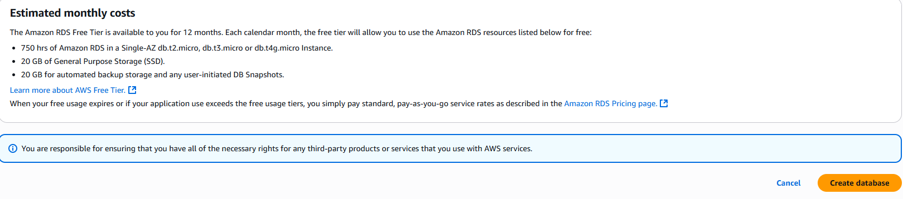

After clicking creating, wait until it's ready and this will be shown

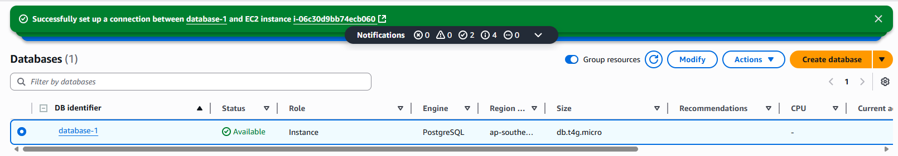

Please noted that the AWS RDS is connected with AWS EC2 that previously we created. Which means you can check the connection using EC2 Bash (Click on Connect button in AWS EC2 for the instance we created earlier)

When EC2 bash is opened:

Insert this to install psql for ec2 bash ( For linux )

sudo dnf search postgresql

I choose version 15

sudo dnf install -y postgresql15
which psql
psql --version

Test connection to RDS instance in EC2 bash

psql --host=<your-rds-endpoint>.ap-southeast-2.rds.amazonaws.com --port=5432 --username=postgresql --dbname=database-1

If psql command does not work you can use these instead

sudo dnf install -y nmap-ncat 
nc -zv database-1.c10mgacs26tc.ap-southeast-2.rds.amazonaws.com 5432

OR using SSL handshake with OPENSSL
openssl s_client -connect database-1.c10mgacs26tc.ap-southeast-2.rds.amazonaws.com:5432

If it connects succesfully, congrats. If it fails, it's the security group setting in your rds-ec2 for port 5432

Remember file pem we created earlier on? Time to use it in your command prompt

Open your command prompt or powershell and insert 

ssh -i "C:\Users\Admin\Downloads\ollamaawskey.pem" `
  -L 5433:database-1.c10mgacs26tc.ap-southeast-2.rds.amazonaws.com:5432 `
  ec2-user@ec2-54-252-237-194.ap-southeast-2.compute.amazonaws.com

you can insert aws command above at here to check as well.

Now for PGADMIN setup. you click on register -> Server
 

If it shows, then congrats.

# Connect to AWS RDS for Django

There are two ways. This really depends on how the team operate and the system architecture.
First one is deploying the project on aws ec2 using ec2 bash then in file .env for RDS_HOSTNAME= <rds-endpoint> (Using for coding, testing, production).

Second one is in file .env for RDS_HOSTNAME=localhost. this one set to use for coding. For testing and production, we need to deploy the project on aws ec2 using ec2 bash then in file .env for RDS_HOSTNAME= <rds-endpoint>

If you use first method, follow these steps: 

Type in command prompt in your PC:
ssh -i "your-key.pem" ec2-user@your-ec2-public-ip

sudo yum update -y
sudo yum install git python3 python3-pip -y
sudo yum install postgresql -y
git clone https://github.com/your-username/your-django-repo.git
cd your-django-repo
cd your_project
python3 -m venv venv
source venv/bin/activate
pip install -r requirements.txt
python manage.py makemigrations
python manage.py migrate
python manage.py collectstatic
python manage.py runserver 0.0.0.0:8000

Then access it in your browser:
http://your-ec2-public-ip:8000

To coding or configure: 

Download Remote-SSH in extension in VSCode
In VS Code, press Ctrl+Shift+P and type SSH: Connect to Host
Select your EC2 instance by entering its public IP address or DNS name
Enter your username and password when prompted
Once connected, you should see a new terminal window in VS Code with the remote shell session active. You can now navigate to your project directory and start working on it remotely.

If you use second method, follow these steps:

Type in command prompt

ssh -i ~/Downloads/ollamaawskey.pem -L 6543:database-1.c10mgacs26tc.ap-southeast-2.rds.amazonaws.com:5432 ec2-user@ec2-54-252-174-64.ap-southeast-2.compute.amazonaws.com

This will open a tunnel from local machine to remote server. Then you can run app using

python manage.py migrate
python manage.py runserver

Run the application and insert at url: http://127.0.0.1:8000/chatbot/ and the result can be viewed as below:

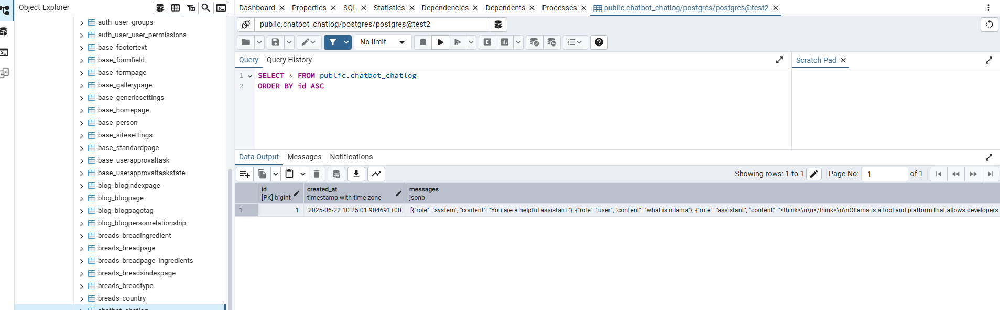

or view in ec2 bash:

psql -h your-rds-endpoint.rds.amazonaws.com -U your-db-username -d your-db-name -p 5432

\dt            -- List tables
SELECT * FROM your_table LIMIT 10;   -- View data

-- To exit psql

\q -- Exit

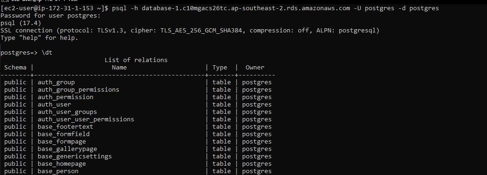

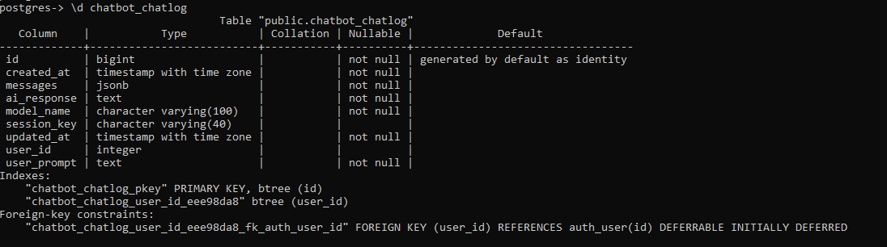

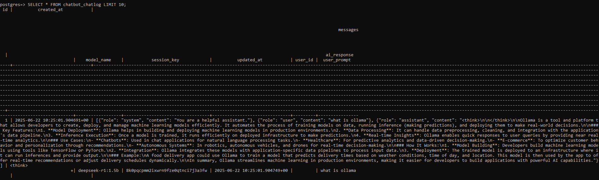