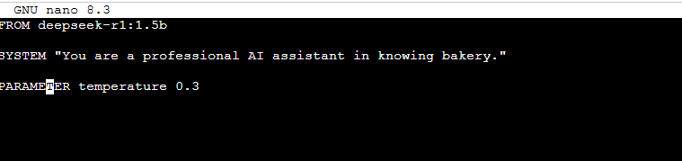
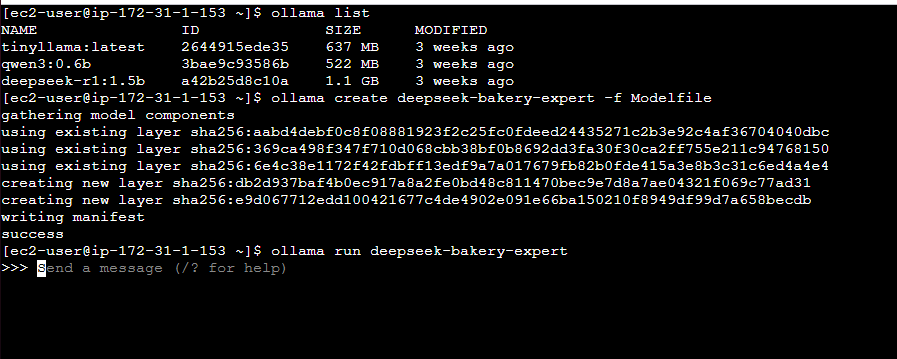

Ollama currently (23/6/2025) does not support fine tune models. However, it is possible to use the prompt tuning method instead.

To do this follow these steps:

-- Check ai model you install
ollama list 

-- Create Modelfile
nano Modelfile

-- Custom Modelfile

Save and exit (Ctrl+O, Enter, Ctrl+X)

-- Create Model with custom modelfile
ollama create deepseek-bakery-expert -f Modelfile

-- Run Model
ollama run deepseek-bakery-expert

