# AwsOllamaWagtailChatbot

This is an Ollama LLM Chatbot on Wagtail-Django CMS that is stored data user input on AWS RDS . Note that the system is also using RAG and Amazon Aurora

## Installation
# Create Key pairs

Go to link: https://ap-southeast-2.console.aws.amazon.com/ec2/home?region=ap-southeast-2#KeyPairs:
or locate Key Pairs in Network & Security in side bar of the website

# Click on Create key pair

# Name your key pair, select format as pem file then click create

# Create a new security group

Go to link: https://ap-southeast-2.console.aws.amazon.com/ec2/v2/home?region=ap-southeast-2#SecurityGroups:
or locate Security Groups in Network & Security in side bar of the website

# Click on create security group

# Create Inbound rule for port 11434 which is port for Ollama server

# Create Instance 

Go to link: https://ap-southeast-2.console.aws.amazon.com/ec2/home?region=ap-southeast-2#Instances:v=3;$case=tags:true%5C,client:false;$regex=tags:false%5C,client:false
or locate Instances in Instances in side bar of the website

# Click on launch instance

Name the instance and choose AMI to run the server.
For the demo, i will use Amazon Linux 2023

Choose the instance type. For this demo, I will use t3.medium

However, it's recommended using something way more powerful and has way more storage like g4dn.xlarge or c6i.large
Choosing the instance type really depends on which AI Model you want to use. For this demo, i am using deepseek-r1 and i am choosing t3.medium due to the cost. 

# Key Pair

Select the key pair created earlier

# Network settings

Check the checkbox for Allow HTTPS traffic from the internet and Allow HTTP traffic from the internet
Moreover, it's recommended to choose your own IP. For this demo, choosing Anywhere (0.0.0.0) or My Ip are both fine.

After all these steps, read the summary and click Launch

# Sucessfully launched

# Then Click Connect

Then follow these step

1. SSH into your EC2 instance

ssh -i /path/to/your-key.pem ec2-user@<EC2_PUBLIC_IP>

2. Install Ollama

curl -fsSL https://ollama.com/install.sh | sh
ollama --version   # verify it prints something like “ollama version 0.1.x”
3. Configure Ollama to listen on all interfaces
Edit /etc/systemd/system/ollama.service so the [Service] block looks like:

[Service]
ExecStart=/usr/local/bin/ollama serve
Environment="OLLAMA_HOST=0.0.0.0"
Restart=always
RestartSec=3
User=ollama
Group=ollama

4. Reload systemd & restart Ollama

sudo systemctl daemon-reload
sudo systemctl restart ollama
sudo systemctl status ollama   # should say “active (running)”

5. Confirm Ollama is listening on 0.0.0.0:11434

ss -tulnp | grep 11434
→ LISTEN  0 4096 0.0.0.0:11434

6. Pull your model (once Ollama is running. If you want other models, see the list here: https://ollama.com/search) 

ollama pull deepseek-r1:1.5b

7. Test the API locally on EC2

curl -X POST http://localhost:11434/api/generate \
  -H "Content-Type: application/json" \
  -d '{"model":"deepseek-r1:1.5b","prompt":"What is Ollama?","stream":false}'
8. Test from your laptop (replace with your real IP)

curl -X POST http://<EC2_PUBLIC_IP>:11434/api/generate \
  -H "Content-Type: application/json" \
  -d "{\"model\":\"deepseek-r1:1.5b\",\"prompt\":\"What is Ollama?\",\"stream\":false}"
  

If you cannot find public IP, there are several ways to do it. 
One way is to go to EC2 console -> Select your instance -> Description tab -> Public IPv4 address

Then go to file chatbot/views.py and change the line 10 to your public ip
OLLAMA_API_URL = "http://<EC2_PUBLIC_IP>:11434/api/generate"

and in chatbot/views.py

payload = {
            "model": "deepseek-r1:1.5b",
            "prompt": user_prompt,
            "stream": False
        }

Change the AI Model to whatever you have downloaded. For example if you download llama2, change it to llama2

# Run Django Server

  python manage.py makemigrations
  
  python manage.py migrate
  
  python manage.py createsuperuser
  
  python manage.py runserver
  
Go to link: localhost:8000/chatbot/

# Create IAM Role

Find IAM and click on Create User

Click on Next 

For Permission Policies, we will create the rds all permission and allow ec2 and rds pgacloud 

Click on attach policies directly and create policies with content as below:

For AllowEC2andRDSforpgacloud

Insert this in json 

{
	"Version": "2012-10-17",
	"Statement": [
		{
			"Effect": "Allow",
			"Action": [
				"ec2:CreateSecurityGroup",
				"ec2:AuthorizeSecurityGroupIngress",
				"ec2:DeleteSecurityGroup",
				"ec2:DescribeSecurityGroups"
			],
			"Resource": "*"
		},
		{
			"Effect": "Allow",
			"Action": [
				"rds:CreateDBInstance",
				"rds:DescribeDBInstances",
				"rds:DescribeDBSubnetGroups",
				"rds:DescribeDBEngineVersions",
				"rds:CreateDBSubnetGroup",
				"rds:ModifyDBInstance",
				"rds:DeleteDBInstance"
			],
			"Resource": "*"
		}
	]
}

For rds-all-permissions insert json

{
	"Version": "2012-10-17",
	"Statement": [
		{
			"Sid": "VisualEditor0",
			"Effect": "Allow",
			"Action": "rds:*",
			"Resource": "*"
		}
	]
}

# Create AWS RDS

Go to link: https://ap-southeast-2.console.aws.amazon.com/rds/home?region=ap-southeast-2#

Click on Databases -> Create database

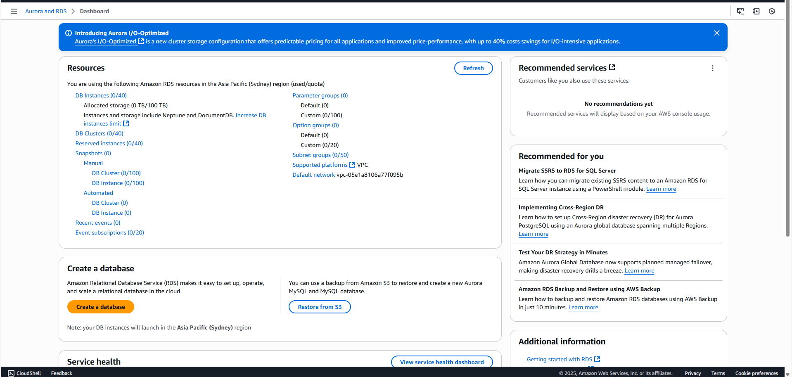

For this demo, i will be using PostgreSQL database engine with engine version PostgreSQL 17.4-R1 and Templates Free Tier.

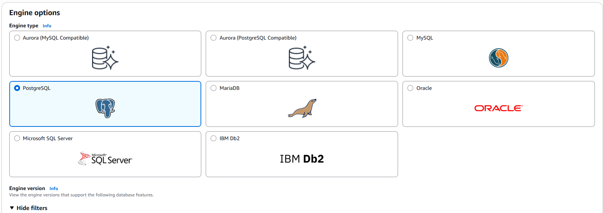

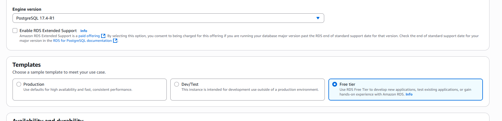

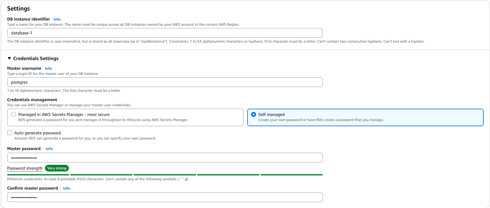

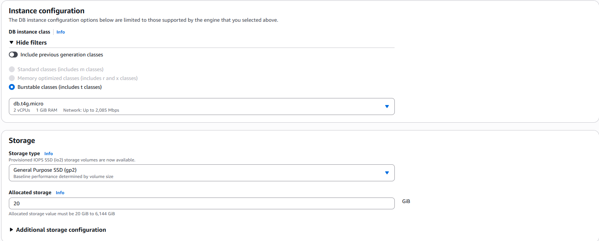

For Connectivity, connect with AWS EC2 that you created early on and running
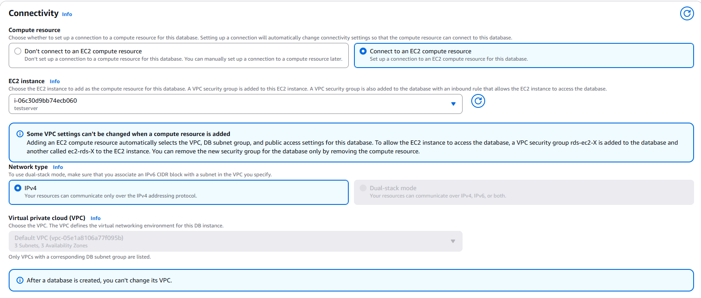

For VPC security group, select the one you created earlier

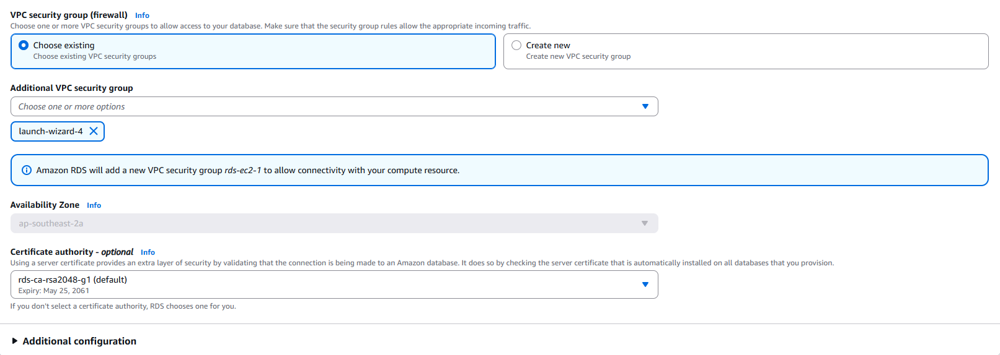

For database authentication, i will use Password authentication. Feel free to use others.

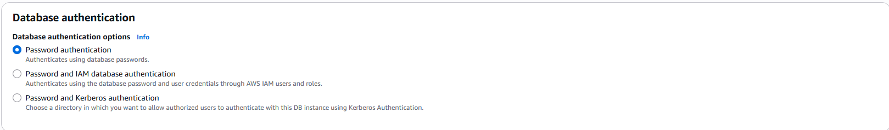

For Monitoring, i will use 7 Days since it's free tier.

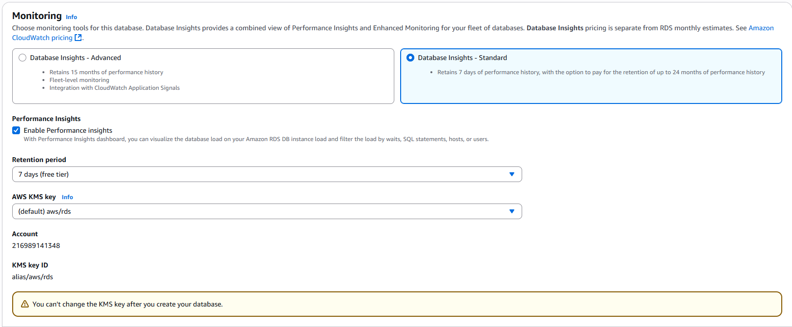

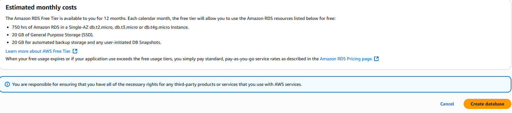

After clicking creating, wait until it's ready and this will be shown

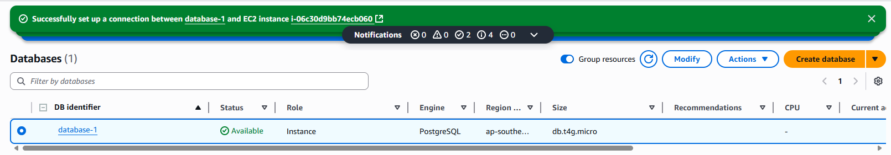

Please noted that the AWS RDS is connected with AWS EC2 that previously we created. Which means you can check the connection using EC2 Bash (Click on Connect button in AWS EC2 for the instance we created earlier)

When EC2 bash is opened:

Insert this to install psql for ec2 bash ( For linux )

sudo dnf search postgresql

I choose version 15

sudo dnf install -y postgresql15
which psql
psql --version

Test connection to RDS instance in EC2 bash

psql --host=<your-rds-endpoint>.ap-southeast-2.rds.amazonaws.com --port=5432 --username=postgresql --dbname=database-1

If psql command does not work you can use these instead

sudo dnf install -y nmap-ncat 
nc -zv database-1.c10mgacs26tc.ap-southeast-2.rds.amazonaws.com 5432

OR using SSL handshake with OPENSSL
openssl s_client -connect database-1.c10mgacs26tc.ap-southeast-2.rds.amazonaws.com:5432

If it connects succesfully, congrats. If it fails, it's the security group setting in your rds-ec2 for port 5432

Remember file pem we created earlier on? Time to use it in your command prompt

Open your command prompt or powershell and insert 

ssh -i "C:\Users\Admin\Downloads\ollamaawskey.pem" `
  -L 5433:database-1.c10mgacs26tc.ap-southeast-2.rds.amazonaws.com:5432 `
  ec2-user@ec2-54-252-237-194.ap-southeast-2.compute.amazonaws.com

you can insert aws command above at here to check as well.

Now for PGADMIN setup. you click on register -> Server

If it shows, then congrats.

# Deploying to Elastic Beanstalk
https://docs.aws.amazon.com/elasticbeanstalk/latest/dg/create-deploy-python-django.html
